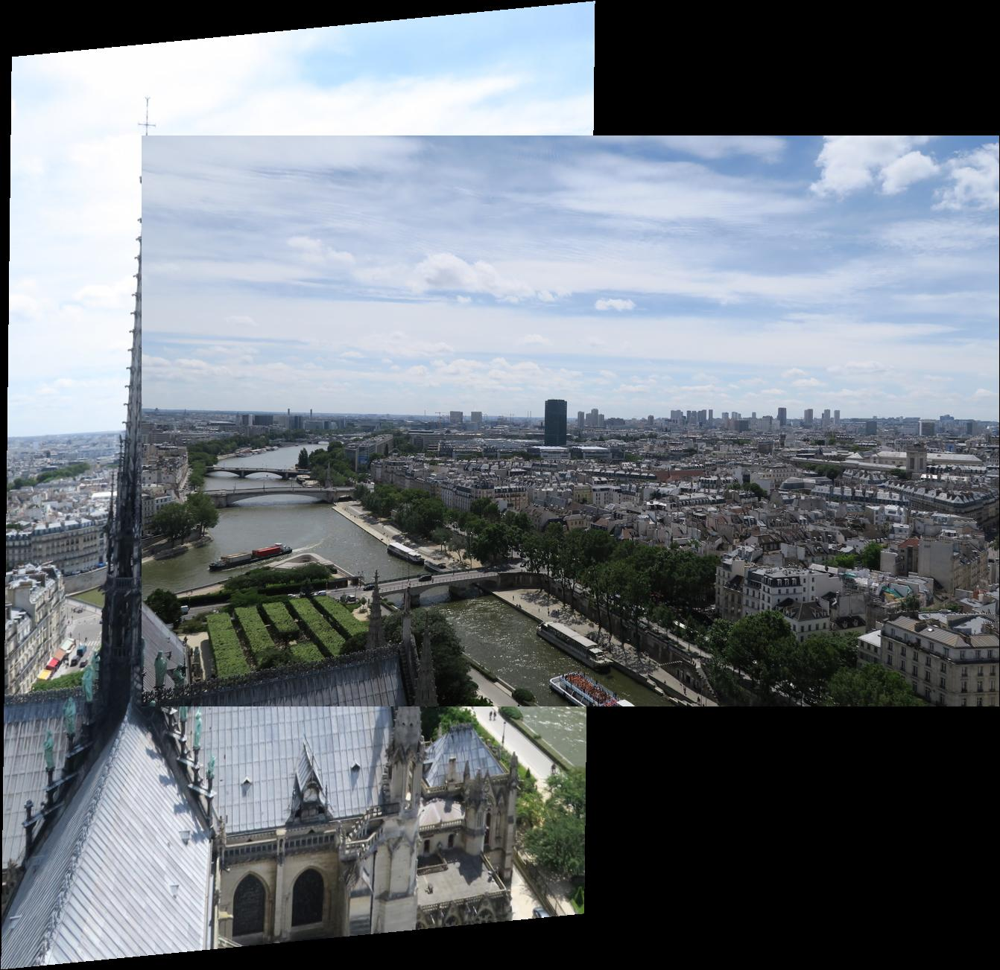

# 呂志娟 <span style="color:red">(102061152)</span>

# Project 2 / Panorama Stitching

## Overview

All the test results are stored in [sellylu/homework2/results/](https://github.com/sellylu/homework2/tree/master/results), and also displayed in [Results](https://github.com/sellylu/homework2/results/blob/master/index.md#Results) section.
This project aims to implement a program which can stitch(combine) pictures of neibour area automatically.

## Implementation

1. **Match Features**

	With the help of package "VL Feat", we can easily find the SIFT feature points. Then, we pairwisely calculate the Euclidean distance between feature descriptors between two comparing pictures. How I do this is making use of Matlab built-in function `repmat(...)`. I iterate through descriptors from image1 and stack each elements to length of descriptors from image2. Computing the distance and ratio across matrix manipulation.
	
	```matlab
for i = 1:length(descriptor1)
	dist = sqrt(sum((repmat(descriptor1(i,:),len_image2,1) - descriptor2).^2,2));
	dist_sort = sort(dist);
	ratio = dist_sort(1)/dist_sort(2);
	if ratio < thresh
		index = find(dist==dist_sort(1));
		match = [match; [i, index]];
	end
end
	```

2. **Fit Transformation**

We have matching pairs of two images, we can then calculate the transformation matrix of fitting one on the other
	
3. **RANSAC**
4. **Stitch**


## Results

